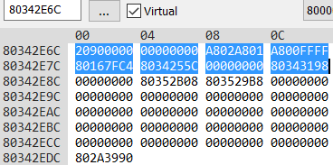
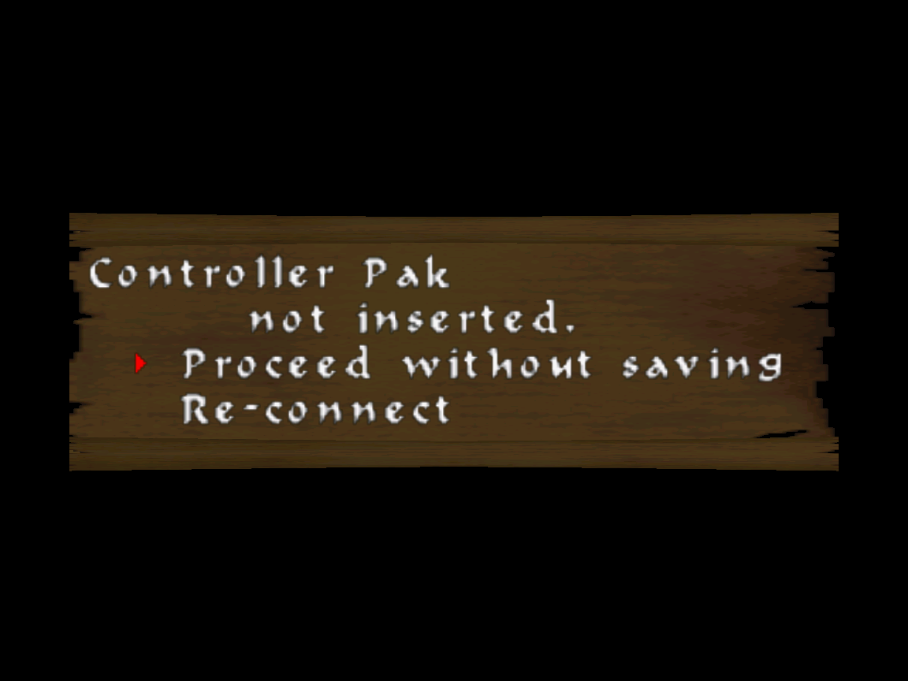
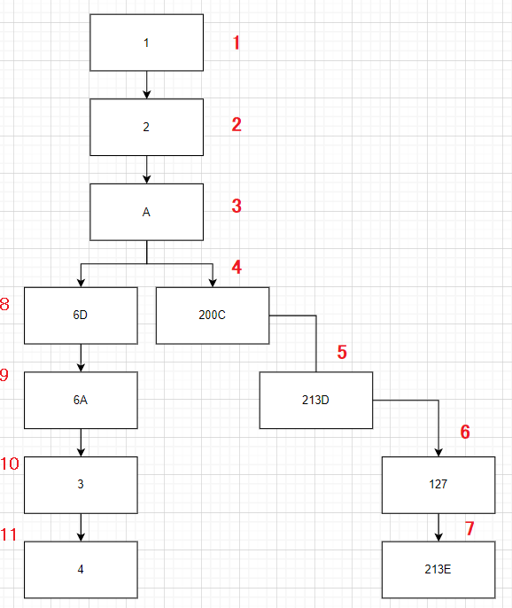
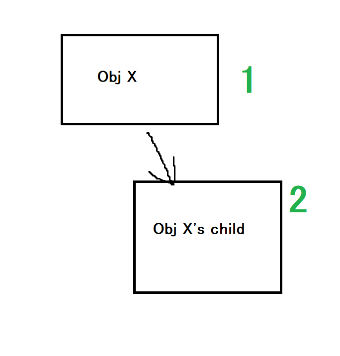
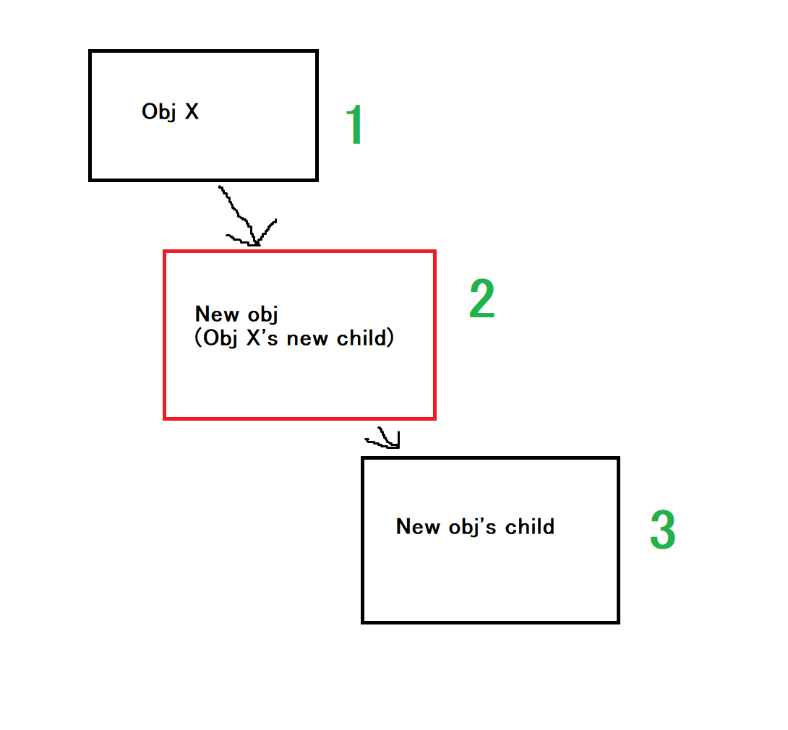
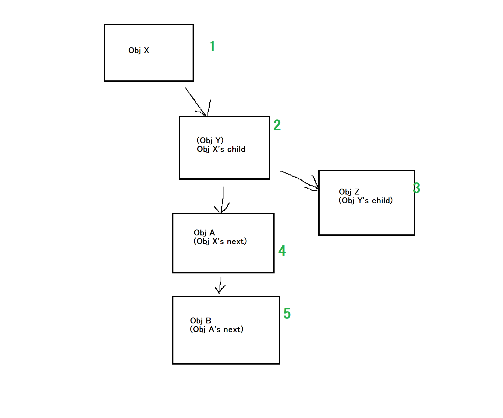
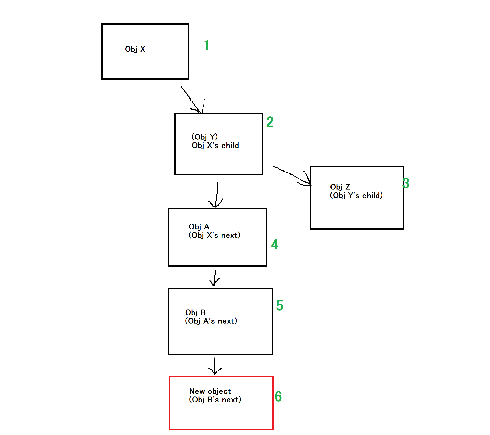

# Objects

**Objects** are a common data structure seen through the game's code.

> [!NOTE]
> Objects were formerly known as *modules*

Objects are used to modularize the code's execution flow by associating code and data to certain objects. This way, said code can only be executed if its associated object is present in memory. Not only that, but it can also be used to assign an order of execution to the code associated to the objects.

Pretty much every piece of code running in the main thread is associated to a certain object (menus, enemies, the player, etc).

## Structure

>*The Gardener's enemy object seen in memory using [Project64's debugger](https://hack64.net/docs/pj64d/).
Highlighted in blue is the object's header.*

All objects are `0x74` bytes long. The first `0x20` bytes consist of a header that is used to track things, while the other `0x54` bytes can vary depending on the object.

In the decomp, the object data structures and its associated functions are declared in `object.h`.

```c
typedef struct cv64_obj_func_inf {
    u8 timer;          // Could also be "number of accesses to function"
    u8 function;       // ID within the functions array
} cv64_obj_func_inf_t; // Size = 0x2

typedef struct cv64_obj_hdr {
    s16 ID;
    s16 flags;
    s16 timer;      // Misc. timer whose purpose depends on the object
    s16 field_0x06;
    cv64_obj_func_inf_t current_function[3];
    s16 functionInfo_ID;
    void (*destroy)(void*); // Officially called "OBJ_destruct"
    struct cv64_obj_hdr_t* parent;
    struct cv64_obj_hdr_t* next;
    struct cv64_obj_hdr_t* child;
} cv64_obj_hdr_t; // Size = 0x20
```

### ID
This is a numeric identifier used to distinguish the object from the rest, as well as to know where the object's associated code and files (if any) can be found.

They are also used to store some execution flag, so in reality this field is composed of two things:

#### Upper 5 bits: Execution flags

```c
NONE         = 0x0000
STAGE_OBJECT = 0x1000   // Sometimes 0x18 is used as well.
// The object's code should be mapped by the TLB
MAP_OVERLAY  = 0x2000
// Marked for deletion
DESTROY      = 0x8000   
```

* STAGE_OBJECT: Used to notify the game that the object is a map actor. This is, an actor that is only meant to be used in a certain map, which includes most map-specific hazards or decorative elements.

* MAP_OVERLAY: This flag indicates that the code associated to the object needs to be mapped by the TLB to an address in [KUSEG](https://en64.shoutwiki.com/wiki/N64_CPU#CPU_Addressing). For more info, [see this section below](#code-mapped-by-the-tlb).

* DESTROY: This is enabled in order to mark this object for deletion. This is, to remove the object from memory next time the game attempts to execute it.</br>
Once an object is destroyed, its code will stop running.

#### Lower 11 bits: The actual identifier

For instance, the Gardener's object ID is 0x2090:</br>
* 0x2000 = Execution flags (MAP_OVERLAY)
* 0x0090 = The actual identifier

There are a total of 554 object IDs assigned by KCEK, starting from 1.</br>
These can all be found in `object_ID.h`

### Flags
These are other sets of flags different from the ones specified above. At the moment, only two are known:

```c
PAUSE = CV64_BIT(14),   // 0x4000
TOP   = CV64_BIT(15)    // 0x8000
```

* **PAUSE**: Temporarily freezes the execution of the object's associated code.
* **TOP**: The only object known to have this flag is `GameStateMgr`. Other than that, it does not seem to affect code execution.

### Timer
This value is used by some objects as a timer for different purposes. For example, the `interactuables` object (the entity that handles pickable items and text spots that you can read with C-Right) uses this timer to know how much time has passed before it can begin to disappear after awhile.

### current_function and functionInfo_ID
See the section: [How the code of an object executes](#how-the-code-of-an-object-executes)

### Parent, child and next
See the section: [Execution tree](#execution-tree)

### Destroy
This is a pointer to the object's destroy function. This function is called when an object no longer needs to be running, and destroys other structs associated to it. This function is also responsible for setting the `DESTROY` flag.

## Execution
```
Note that when it's said that an object is running, it's actually the code associated to it that runs, as the object struct itself does not contain code
```

As mentioned before, every object has certain code associated to it, so in order to execute it, said object must be spawned in memory.

### Execution tree
All objects are organized in a tree-like manner, where objects at the top are executed first, then the ones at the bottom. To explain this further, let's use the following diagram as an example.

This is how the execution tree looks like when idling in the screen that appears when booting the game with no Controller Paks plugged in:




Each box represents an object, where the number inside it is its `ID`. The arrows pointing straight down / down and left represent the `next` pointer, whereas the arrows pointing down and right are the `child` pointers.</br>
The numbers in red represent the order of execution of each object in the tree.

In the execution tree, objects are executed from top to bottom, starting from object ID 1 (`GameStateMgr`).

After an object is done being executed, it starts executing the `child` object, if it has it. If it doesn't have a child, then it goes to the `next` object and starts executing that.

This continues on and on recursively until there're no more `child` / `next` objects to execute, at which point it goes back in the tree and starts execution of the remaining objects.

If there aren't anymore left, then execution for the current frame is done, and the cycle repeats for the next frame.

### Objects array
All objects are allocated in the `objects_array`. This array has a total capacity of 384 objects (if the game attempts to allocate an object when the array is full, then said object will fail to spawn).

On this array, objects are allocated one after the other sequentially. The way the game determines a slot is empty is by finding the first object slot in the array where the ID value is 0 (remember, objects start from ID 1).

When objects are destroyed, their IDs are eventually set to 0, which tells the game their slot is free for a new object to occupy.

## Object spawning and execution
### Spawning an object
There're two functions used to spawn an object in memory:</br>

```c
void* object_create(void* parent, object_t ID);
```
```c
void* object_createAndSetChild(void* parent, object_t ID);
```

On these functions, `parent` is the parent object, and `ID` is the identifier of the new object to spawn

The difference bewtween these two functions reside in the location inside the execution tree the newly created object will end up in.

#### `object_create`

The new object will be set as the `child` object of its parent, and the previous `child` of the parent is now set as the new object's `child`

Scentially what this means is that the new object will now execute right after the parent is done executing, and all of the parent's previous children will now execute after the new object.

- **Before**



- **After**



#### `object_createAndSetChild`

When an object is spawned through this function, it checks if the parent has any `child` objects. If it does, it sets the new object as the last one in the column of `next` objects from said child.

This makes it so that the newly created object will execute at the very bottom of the list of objects from the parent's "branch".

- **Before**



- **After**



```
The green numbers in the image above represent the order of execution. The box in red is the newly spawned object
```

In both cases, if the function is called with parent = `NULL`, then a new "branch", separate from the regular execution tree will be created, but in order to execute that, you need to explicitly call `object_execute` on that object, as it won't be in the same "branch" as the one topped by `GameStateMgr`. See below for more information.

### Executing an object's code
Once an object is spawned, its code will automatically begin execution in the next frame.

To explain how this process works: in order to execute an object, the game calls `object_execute` to execute an object's associated code and all its `child` / `next`.

```c
void object_execute(cv64_obj_hdr_t* object);
```

Where `object` is the pointer to the object at the beginning of the "branch".

For example, if calling `object_execute` and passing the pointer to `Obj X` as the argument, all objects in the diagram will execute one frame worth of code.

But if instead, the same function is called with `Obj A`'s pointer as the argument, then only `Obj A` and `Obj B` will execute.


In practice, `GameStateMgr` (object ID 1) is always the top-most object in the execution tree, so any `child` / `next` objects that come down from it will automatically execute, no need to explicitly call `object_execute` on the newly spawned object.

#### `objects_functions`
In order to know where the code associated to said object is located, the identifier part of its `ID` is used as an index into an array known as `objects_functions`.

This is an array of 554 function pointers (one per object) containing the beginning of the object's associated code. Each entry in this array is called an `entrypoint` function.

Every frame, the game iterates through all the objects allocated in `objects_array`, looks for its `entrypoint` function, and executes it.

##### **Code mapped by the TLB**
Most [overlays](https://en.wikipedia.org/wiki/Overlay_(programming)) are loaded dynamically in memory before being executed.</br>
This is, they're only loaded into memory when needed (for example, the code associated to an enemy that only appears on specific maps). And when they're not needed anymore, they're unloaded.

Because this code is loaded dynamically, it also means that the address of the `entrypoint` function within said code is not guaranteed to always be the same.
The thing is, `objects_functions` only stores a single address that is not meant to be changed during gameplay, which is problematic in this case, since the address can be different each time.

Not only that, but overlays, are compiled with a specific `entrypoint` address that, if changed, can make the code not work properly (things such as branch assembly instructions can only work if the overlay is loaded into the same `entrypoint` address it was compiled to, otherwise it will likely branch to unintended places in memory and crash the game).

In order to fix this issue, the developers chose to map the code for overlays to certain addresses within the KUSEG segment (most commonly addresses 0x0F000000 and 0x0E000000) before the execution of its code begins.

This will make the CPU think that said dynamically loaded code is stored at 0x0F000000 / 0x0E000000. And, if the overlay code is compiled with the `entrypoint` address set to any of those values, execution will work properly.

And this is exactly what the developers did. All overlays were compiled with the `entrypoint` address set to 0x0F000000, except for the cutscene-related overlays, which were compiled with address 0x0E000000 instead.
 
### How the code of an object executes
As said above, every object has an associated `entrypoint` function, which is guaranteed to **always** be executed as long as the object is in memory.

For most objects, this function is used to branch into another set of functions, depending on the current "state" of the object, so to speak.

This set of functions are stored as function pointers arrays, each one with an ID. This is where the `current_function` variable of the object's header comes into play.

It consists of two fields:
* **timer**: A timer value that measures for how long the function has been executed. When it gets to the max value (255), it rolls back to 0.

* **function**: The ID of the function pointer entry inside the array mentioned above. The game uses this to know which one of the object's specific functions to execute.

An object can have up to three "levels" of function pointers to execute functions from, so the game will first execute the functions in level 0, then level 1, then level 2, if needed. The `functionInfo_ID` variable in the object header is used to know which level to look at (set to -1 by default).

An example of all three levels being used can be found in the Player's actor, to assign "states" and "substates" to the player's actions.</br>
For example, level 0 contains the ID of the main "state" function (i.e. JUMP), and then level 1 contains the ID of the specific "substate" of said state (for example, in the case of jumping, a function for propelling up, another function for falling down, etc).

#### Example: Konami / KCEK Logo
The function pointers array for the Konami / KCEK logo object looks like this:

```c
cv64_konamilogo_func_t cv64_konamilogo_funcs[] = {
    cv64_konamilogo_init,               // 0        
    cv64_konamilogo_fade_in,            // 1
    cv64_konamilogo_wait,               // 2
    cv64_konamilogo_fade_out,           // 3
    cv64_konamilogo_kcek_fade_in,       // 4
    cv64_konamilogo_kcek_wait,          // 5
    cv64_konamilogo_kcek_fade_out,      // 6
    func_8000E860                       // 7
};
```
So, if `current_function[0].function` for the Konami / KCEK logo object is equal to 0, then it will execute the `cv64_konamilogo_init`. If it's 1, it will execute `cv64_konamilogo_fade_in`, and so on.

The function ID in the `function` field will always be executed until its changed. In order to change it, there're various functions the devs used, but the most commonly used ones are:

* `object_curLevel_goToNextFuncAndClearTimer`: Used to branch to the next function in the array (i.e. function++)

* `object_curLevel_goToFunc`: Used to branch to a specific function ID within the array, specified by the third argument (i.e. function = ID)

## Groups
All objects are grouped into different categories depending on what they're meant to be used for. Depending on the category, the objects may have a different structure layout, and they may be assigned different *parent* objects when spawned.

* **Engine / Game States**: Used for engine related tasks, as well as being utilized as the "main" object of a game state.
* **Cutscenes**: Used for cutscenes and cutscene-related tasks.
* **Cameras**: Used for camera-related tasks.
* **Player**: Includes the player actors, and player-related objects.
* **Enemies**: Used for enemies that are meant to spawn in different maps.
* **Effects**
* **Menus**
* **Maps**: Used for map-handling tasks, such as objects that handle the culling of map pieces / chunks and the creation of the map's collision.
* **Map Actors**: Here go all actors that are meant to be used in one single map. Can be things such as enemies, hazards or decorative elements.

The headers for these objects are stored inside `include/game/objects`, in one directory per category.